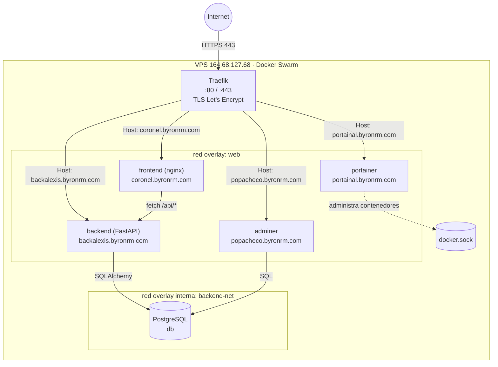
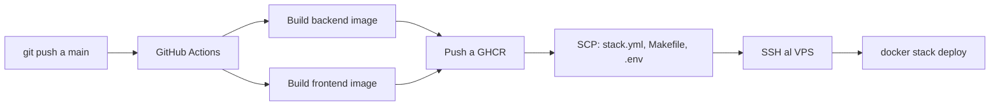

# Diagrama de arquitectura

## Flujo de una solicitud

1. El navegador resuelve `coronel.byronrm.com` a `164.68.127.68` (registro DNS tipo A).
2. La solicitud llega por el puerto 443 a **Traefik**, que valida el certificado TLS (Let's Encrypt) y enruta segun el header `Host`.
3. Para el registro de usuarios, el **frontend** hace `fetch()` contra `https://backalexis.byronrm.com/api/usuarios`, que Traefik enruta al servicio **backend**.
4. El **backend** valida los datos, hashea la contraseña y los guarda en **PostgreSQL** a traves de la red interna `backend-net` (sin salida a internet).
5. **Adminer** permite inspeccionar la base de datos graficamente, tambien publicado via Traefik.
6. **Portainer** administra todos los contenedores del Swarm usando el socket de Docker del nodo manager.

## Redes Docker

| Red | Tipo | Proposito |
|---|---|---|
| `web` | overlay, attachable | Unica red por la que Traefik enruta trafico externo |
| `backend-net` | overlay, `internal: true` | Aisla la base de datos: solo backend y adminer pueden alcanzarla, sin salida a internet |

## CI/CD

